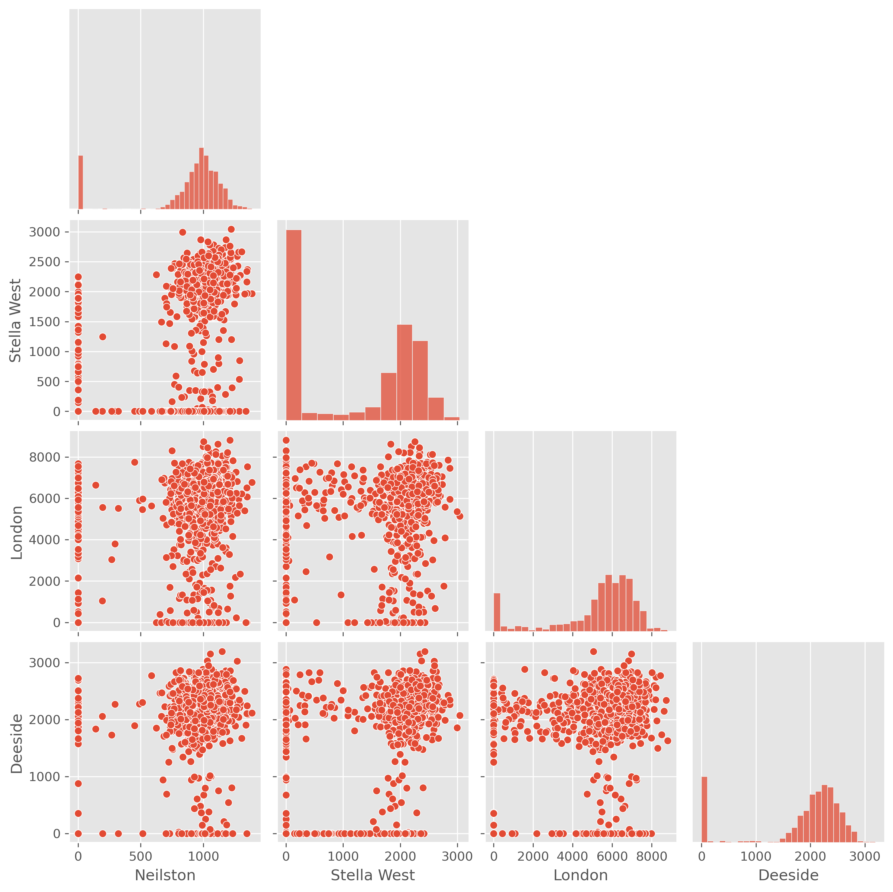
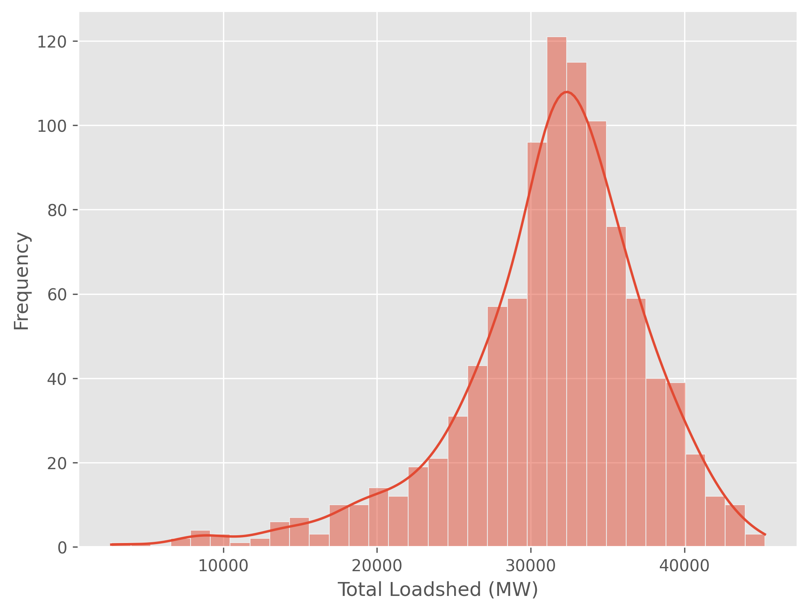

# DAFNI - BRINES

BRINES is a **probabilistic forecasting model** designed to estimate the **net energy demand surplus** after accounting for renewable energy generation, specifically **wind and solar power.** 

The model integrates probabilistic analysis to account for **uncertainties in energy demands and renewable generation.**

The model can be used to simulate **expansion scenarios for wind and solar generators** and **climate variables such as temparature, wind, and solar.**

The model can calculate **demand surplus** for each city per sample.  
The figure below shows the calculated **surplus for 1,000 samples** across example cities.

The **total loadshed** can be computed as shown below:

## Developers & contact
- Mr Uichan Seok, Seoul National University (98ktx@snu.ac.kr)
- Dr Ji-Eun Byun, University of Glasgow (ji-eun.byun@glasgow.ac.uk)
- Dr Hannah Bloomfield, Newcastle University (hannah.bloomfield@newcastle.ac.uk)
- Dr Colin Manning, Newcastle University (colin.manning@newcastle.ac.uk)
- Sean Wilkinson, Newcastle University (sean.wilkinson@newcastle.ac.uk)
- Prof Junho Song, Seoul National University (junhosong@snu.ac.kr)

For any questions or discussions, please contact ji-eun.byun@glasgow.ac.uk.

## Datasets required
Infrastructure data
    - buses
    - Wind generators
    - PV generators
    - transmission lines

Climate data
    - temperature data (per city)
    - surface wind speed data (per city)
    - surface irradiance data (per city)
**Note:** Multiple files can be used for one city. In this case they are merged automatically for analysis.

Mapping data
    - city name from climate data files mapped to original city name used in infrastructure datasets

## Simulations
### Infrastructure expansion
The **wind generator, PV generator, and transmission line** datasets can be modified.

### Climate data
Climate data files can be **replaced** to historic data or simulation data by different climate models.

## Tutorial video
(Coming soon!)
We are currently preparing a tutorial video on how to run and interpret BRINES. Stay tuned for updates.

## Publication
(Coming soon!)
The technical details of BRINES are under preparation for publication. We will update this section soon with links to relevant papers and reports.
